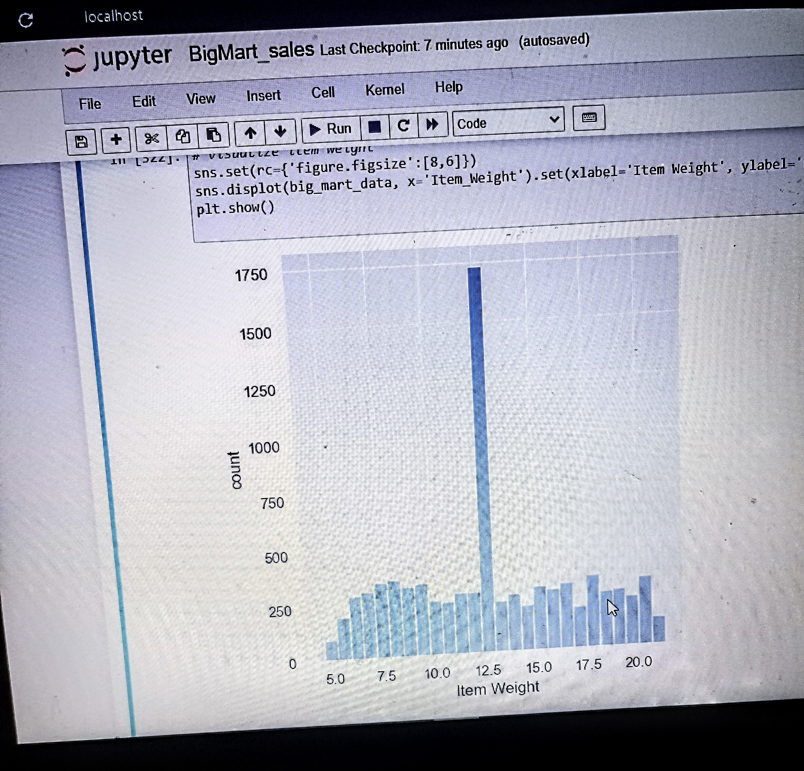
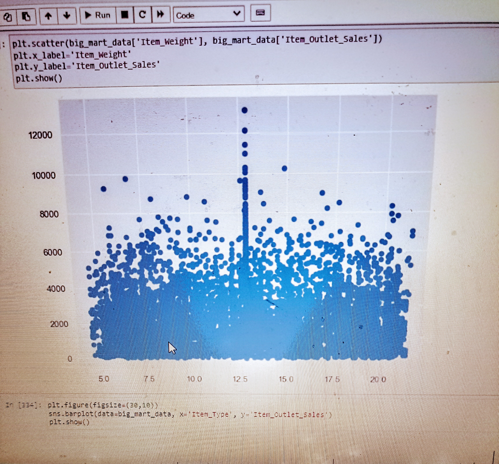

# BigMart Sales Prediction

# Introduction

## Sales
Sales refers to the selling of goods and services. It entails observing and understanding customers needs in terms of services and commodities, thereby responding to them in exchange for money.

## Salespeople and customers
As discussed above, services and commodities need to be exchanged, this exchange is done between a salesperson and a customer. A salesperson, also called sales rep. is someone whose job is to sell products or services. A customer is the person on the other end of the trade, who buy goods or hire a service. Sometimes a salesperson sell to other businesses or organizations. In most cases, a salesperson sells by communicating online instead of the door-to-door travel that's common in the past.

## Common types of sales, their advantages and disadvantages
The common types of sales include Business to Business (B2B) sales, Business to Customer (B2C) sales and Enterprise (Complex) sales

### ***B2B***
Business to Business sales involve selling to other companies or businesses. B2B sales involve a more complex setup since it takes a lot to figure out which customers stays and is dedicated. B2B type tends to result in higher profit since products are usually sold in bulk.

### ***B2C***
Business to Customer is another type of sales. Its the most common type and it involves selling directly to a customer. In this case, the seller isn't necessarily the creator of the product but a distributor. Unlike B2B, it doesn't involve bulk buying since products are being bought for individual or household use which can result in smaller purchase size. In B2C, businesses have control over customer experiences which can lead to better customer service and better selling.

### ***Enterprise***
Enterprise sales are complex sales because it involves large companies. This involves businesses that sells to big corporations. This involves large deal sizes and high risks and take longer sales cycle. Higher revenue is one of the benefits of this type of sales since big clients with huge budgets are being targeted.

## Lead generation and Marketing
Marketing is the process of promoting a product or service so as to attract customers. This usually involves content marketing, SEO, social media marketing and email marketing. Lead is someone who shows interest in a company's product or service. Lead generation involve searching for people who may be potentially interested in your product or service and convincing them to buy or hire.

## Sales prediction
It simply means predicting the sale of a product or service. It refers to the use of various machine learning algorithms to determine if a product, commodity or service will be purchased or hired. Machine learning is a form of data science that involves training a machine to make accurate decisions.

Using machine learning to predict sales can be a benefit and an advancement to selling and marketing by  helping you set better goals and reaching your target audience, improving how well you understand customers, thus, attaining revenue efficiency.

# Objectives
1. Data understanding and cleaning
2. Perform exploratory data analysis
3. Build ML models to predict sales
4. Evaluate models

# Methods and hypothesis
The key to analytics is data. Sales data were gathered from Big Mart, which is a Grocery Super Market Brand. The data was taken from Kaggle.

### 1. Data understanding and cleaning
Here we loaded the data as a pandas DataFrame, understood the data and handled some missing values. We also identified features that are categorical and those that are numerical.

### 2. EDA
Here we understood the data from a statistical look. Another thing we did was to correlate the columns with our target column and understood the relationship between the more correlated columns. We also did categorical data transformation where we converted the categorical columns to numerical using LabelEncoder(). We generated the below images from the visualization:

Above is a normal distribution with 12.5 being the medium value. There is a bit of bias towards the 12.5 since it is the value we used in filling the missing values, hence, it's also the highest occuring value.

In img 2, the visibility value ranges between 0.0 - 0.3, with 0.15 being the median. The viisbility value of most of the items lie between 0.03 - 0.05. We can also notice that the data is skewed.

We can visualize the features that are strongly correlated with our target variable. They are Item_Weight, Item_type, Item_Fat_Content, Outlet_Establishment_Year, Outlet_Location_Type

From the related visualizations above:
- Products whose weight are 12.5 tend to have high sales
- Starchy food and Seafood sold the most
- Regular Fat content sold the most
- The best sale was in 1985, Business was very bad in 1998
- Location type Tier 2 buys a lot.

### 3. Build ML models to predict sales
Here we build our machine learning models using some common regression algorithms: DecisionTreeRegressor() and LinearRegression()

### 4. Evaluating the models
We evaluated the r2_score of the models with our DecisionTreeRegressor() given us 0.5732704288038205 and LinearRegression() gave us 0.4862438042517587.
